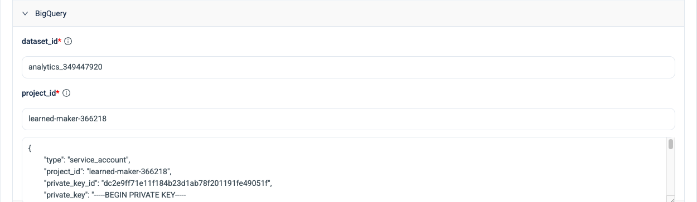
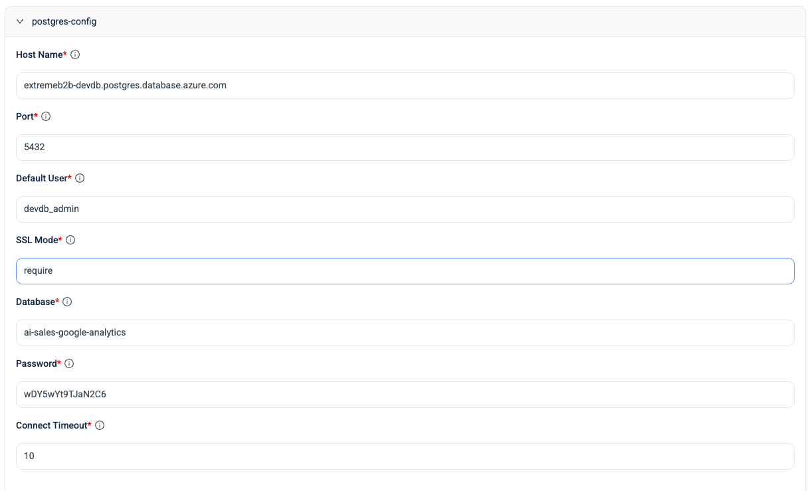
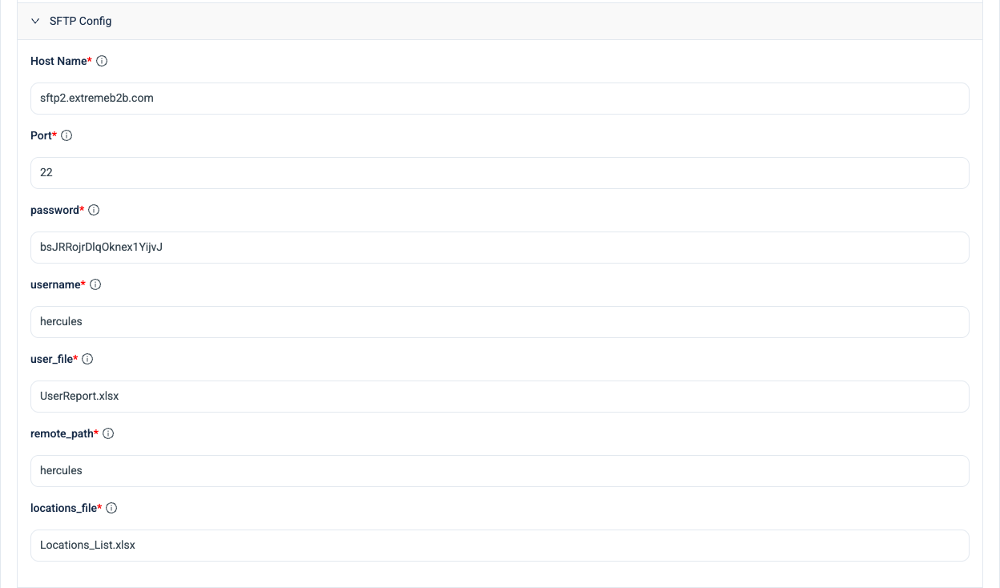

# Google Analytics Intelligence System

A multi-tenant sales intelligence platform that transforms Google Analytics data into actionable insights. Built with FastAPI microservices and a Next.js dashboard.

## Overview

This system processes GA4 data to identify sales opportunities, track customer behavior, and automate follow-up tasks. Each tenant operates in complete isolation with their own data sources and configurations.

## Architecture

```
┌─────────────────────────────────────────────────────────────────┐
│                        Dashboard (Next.js)                       │
│                         localhost:3000                           │
└─────────────────────────────────────────────────────────────────┘
                                 │
        ┌────────────────────────┼────────────────────────┐
        ▼                        ▼                        ▼
┌───────────────┐      ┌───────────────┐      ┌───────────────┐
│   Analytics   │      │     Data      │      │     Auth      │
│    Service    │      │    Service    │      │    Service    │
│   Port 8001   │      │   Port 8002   │      │   Port 8003   │
└───────────────┘      └───────────────┘      └───────────────┘
        │                        │                        │
        └────────────────────────┼────────────────────────┘
                                 ▼
                    ┌─────────────────────────┐
                    │   PostgreSQL Database   │
                    │   (Multi-Tenant Data)   │
                    └─────────────────────────┘
```

## Quick Start

### Prerequisites
- Python 3.11+ with [uv](https://astral.sh/uv)
- Node.js 18+
- PostgreSQL 14+

### Setup

```bash
# Install dependencies and initialize database
make setup

# Start all services
make dev
```

### Access Points
| Service | URL |
|---------|-----|
| Dashboard | http://localhost:3000 |
| Analytics API | http://localhost:8001/docs |
| Data API | http://localhost:8002/docs |
| Auth API | http://localhost:8003/docs |

---

## Multi-Tenant Configuration

Each tenant requires configuration for four external services. These are configured during OAuth login and stored securely in the database.

### 🎬 Video Walkthrough

Watch the complete tenant setup process:

[📹 Setting Up a New Tenant](assets/Setting%20Up%20a%20New%20Tenant%20for%20Google%20Analytics%20Dashboard.mp4)

### BigQuery (GA4 Data Source)

Connects to Google Analytics 4 data via BigQuery.

| Field | Description | Example |
|-------|-------------|---------|
| `dataset_id` | BigQuery dataset containing GA4 export | `analytics_349447920` |
| `project_id` | Google Cloud project ID | `learned-maker-366218` |
| `credentials` | Service account JSON key | `{"type": "service_account", ...}` |



**Setup Steps:**
1. Enable GA4 BigQuery Export in your Google Analytics property
2. Create a service account in Google Cloud Console
3. Grant BigQuery Data Viewer role to the service account
4. Generate and download the JSON key

---

### PostgreSQL (Tenant Database)

Each tenant's analytics data is stored in PostgreSQL with row-level isolation.

| Field | Description | Example |
|-------|-------------|---------|
| `host` | Database server hostname | `extremeb2b-devdb.postgres.database.azure.com` |
| `port` | Database port | `5432` |
| `database` | Database name | `ai-sales-google-analytics` |
| `user` | Database username | `devdb_admin` |
| `password` | Database password | `••••••••` |
| `ssl_mode` | SSL connection mode | `require` |
| `connect_timeout` | Connection timeout (seconds) | `10` |



---

### SFTP (User & Location Data)

Master data for users and locations is synced via SFTP.

| Field | Description | Example |
|-------|-------------|---------|
| `host` | SFTP server hostname | `sftp2.extremeb2b.com` |
| `port` | SFTP port | `22` |
| `username` | SFTP username | `hercules` |
| `password` | SFTP password | `••••••••` |
| `remote_path` | Base directory path | `hercules` |
| `user_file` | User data filename | `UserReport.xlsx` |
| `locations_file` | Locations data filename | `Locations_List.xlsx` |



---

### SMTP (Email Reports)

Automated email reports are sent via SMTP.

| Field | Description | Example |
|-------|-------------|---------|
| `server` | SMTP server hostname | `smtp.office365.com` |
| `port` | SMTP port | `587` |
| `user_name` | SMTP username/email | `admin@extremeb2b.com` |
| `password` | SMTP password | `••••••••` |
| `use_tls` | Enable TLS encryption | `true` |
| `from_name` | Sender display name | `Sales Analytics Team` |
| `from_address` | Sender email address | `admin@extremeb2b.com` |


---

## Environment Variables

### Backend (`backend/.env`)

```env
# Database (Control Plane)
POSTGRES_HOST=localhost
POSTGRES_PORT=5432
POSTGRES_USER=analytics_user
POSTGRES_PASSWORD=your_password
POSTGRES_DATABASE=google_analytics_db

# Service Ports
ANALYTICS_SERVICE_PORT=8001
DATA_SERVICE_PORT=8002
AUTH_SERVICE_PORT=8003

# Environment
ENVIRONMENT=DEV
LOG_LEVEL=INFO
CORS_ORIGINS=http://localhost:3000

# Auth
BASE_URL=https://your-domain.com
```

### Dashboard (`dashboard/.env.local`)

```env
NEXT_PUBLIC_ANALYTICS_API_URL=http://localhost:8001/api/v1
NEXT_PUBLIC_DATA_API_URL=http://localhost:8002/api/v1
NEXT_PUBLIC_AUTH_API_URL=http://localhost:8003/api/v1
```

---

## Available Commands

```bash
# Setup
make setup              # Full installation (backend + frontend + database)
make install_backend    # Install Python dependencies
make install_dashboard  # Install Node.js dependencies
make db_setup           # Initialize database schema

# Development
make dev                # Start all services
make services_start     # Start backend services only
make run_dashboard      # Start frontend only
make stop_services      # Stop all services

# Maintenance
make db_clean           # Reset database (WARNING: deletes data)
make clean              # Clear logs and cache
make logs               # View service logs
make help               # Show all commands
```

---

## Data Flow

```
┌──────────────┐     ┌──────────────┐     ┌──────────────┐
│  BigQuery    │     │    SFTP      │     │  Dashboard   │
│  (GA4 Data)  │     │ (User Data)  │     │   Request    │
└──────┬───────┘     └──────┬───────┘     └──────┬───────┘
       │                    │                    │
       ▼                    ▼                    ▼
┌─────────────────────────────────────────────────────────┐
│                     Data Service                         │
│              (Ingestion & Processing)                    │
└─────────────────────────┬───────────────────────────────┘
                          │
                          ▼
┌─────────────────────────────────────────────────────────┐
│                 PostgreSQL Database                      │
│          (Tenant-Isolated Analytics Data)                │
└─────────────────────────┬───────────────────────────────┘
                          │
                          ▼
┌─────────────────────────────────────────────────────────┐
│                   Analytics Service                      │
│         (Reports, Tasks, Email Automation)               │
└─────────────────────────┬───────────────────────────────┘
                          │
          ┌───────────────┼───────────────┐
          ▼               ▼               ▼
    ┌──────────┐   ┌──────────┐   ┌──────────┐
    │Dashboard │   │  Email   │   │   API    │
    │   UI     │   │ (SMTP)   │   │ Response │
    └──────────┘   └──────────┘   └──────────┘
```

---

## Features

### Analytics Dashboard
- Revenue & purchase metrics
- Cart abandonment tracking
- Search pattern analysis
- Location performance comparison

### Task Management
- Purchase follow-ups
- Cart recovery workflows
- Search optimization tasks
- Repeat visitor engagement

### Email Automation
- Branch-wise HTML reports
- Sales rep mappings
- Delivery tracking
- Template customization

### Data Management
- GA4 data ingestion
- Job monitoring
- Data availability tracking
- Error recovery

---

## Troubleshooting

### Service Health Checks
```bash
curl http://localhost:8001/health  # Analytics
curl http://localhost:8002/health  # Data
curl http://localhost:8003/health  # Auth
```

### Common Issues

**Port conflicts:**
```bash
lsof -i :8001 :8002 :8003 :3000
make stop_services
```

**Database connection:**
```bash
psql -h localhost -U analytics_user -d google_analytics_db
```

**View logs:**
```bash
make logs
# or directly
tail -f backend/logs/*.log
```

---

## Project Structure

```
google-analytics/
├── backend/
│   ├── common/           # Shared utilities
│   ├── database/         # Schema & functions
│   ├── services/
│   │   ├── analytics_service/
│   │   ├── data_service/
│   │   └── auth_service/
│   └── scripts/          # DB management
├── dashboard/
│   └── src/
│       ├── app/          # Next.js pages
│       ├── components/   # React components
│       └── lib/          # Utilities
└── assets/               # Screenshots & videos
```

---

## Documentation

- [Backend Architecture](backend/docs/ARCHITECTURE.md)
- [API Reference](backend/docs/API.md)
- [Database Schema](backend/docs/DATABASE.md)
- [Development Guide](backend/docs/DEVELOPMENT.md)
- [Operations Runbook](backend/docs/RUNBOOK.md)
